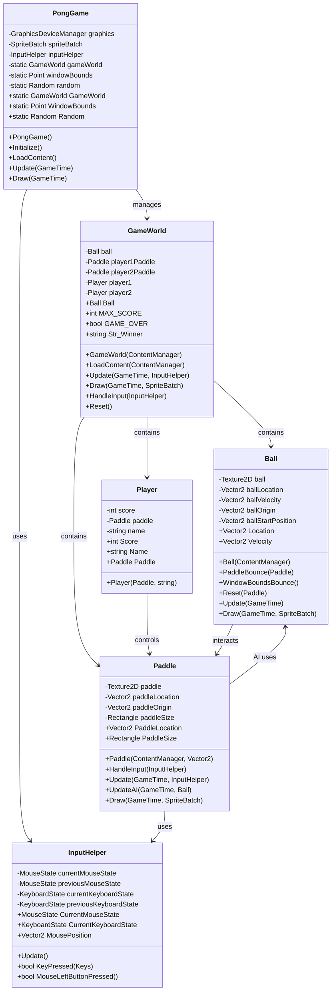

```mermaid

classDiagram
    class PongGame {
        -GraphicsDeviceManager graphics
        -SpriteBatch spriteBatch
        -InputHelper inputHelper
        -static GameWorld gameWorld
        -static Point windowBounds
        -static Random random
        +PongGame()
        +Initialize()
        +LoadContent()
        +Update(GameTime)
        +Draw(GameTime)
        +static GameWorld GameWorld
        +static Point WindowBounds
        +static Random Random
    }

    class GameWorld {
        -Ball ball
        -Paddle player1Paddle
        -Paddle player2Paddle
        -Player player1
        -Player player2
        +GameWorld(ContentManager)
        +LoadContent(ContentManager)
        +Update(GameTime, InputHelper)
        +Draw(GameTime, SpriteBatch)
        +HandleInput(InputHelper)
        +Reset()
        +Ball Ball
        +int MAX_SCORE
        +bool GAME_OVER
        +string Str_Winner
    }

    class Player {
        -int score
        -Paddle paddle
        -string name
        +Player(Paddle, string)
        +int Score
        +string Name
        +Paddle Paddle
    }

    class Paddle {
        -Texture2D paddle
        -Vector2 paddleLocation
        -Vector2 paddleOrigin
        -Rectangle paddleSize
        +Paddle(ContentManager, Vector2)
        +HandleInput(InputHelper)
        +Update(GameTime, InputHelper)
        +UpdateAI(GameTime, Ball)
        +Draw(GameTime, SpriteBatch)
        +Vector2 PaddleLocation
        +Rectangle PaddleSize
    }

    class Ball {
        -Texture2D ball
        -Vector2 ballLocation
        -Vector2 ballVelocity
        -Vector2 ballOrigin
        -Vector2 ballStartPosition
        +Ball(ContentManager)
        +PaddleBounce(Paddle)
        +WindowBoundsBounce()
        +Reset(Paddle)
        +Update(GameTime)
        +Draw(GameTime, SpriteBatch)
        +Vector2 Location
        +Vector2 Velocity
    }

    class InputHelper {
        -MouseState currentMouseState
        -MouseState previousMouseState
        -KeyboardState currentKeyboardState
        -KeyboardState previousKeyboardState
        +Update()
        +MouseState CurrentMouseState
        +KeyboardState CurrentKeyboardState
        +Vector2 MousePosition
        +bool KeyPressed(Keys)
        +bool MouseLeftButtonPressed()
    }

    PongGame --> GameWorld : manages
    PongGame --> InputHelper : uses
    GameWorld --> Ball : contains
    GameWorld --> Paddle : contains
    GameWorld --> Player : contains
    Player --> Paddle : controls
    Paddle --> InputHelper : uses
    Paddle --> Ball : AI uses
    Ball --> Paddle : interacts
```