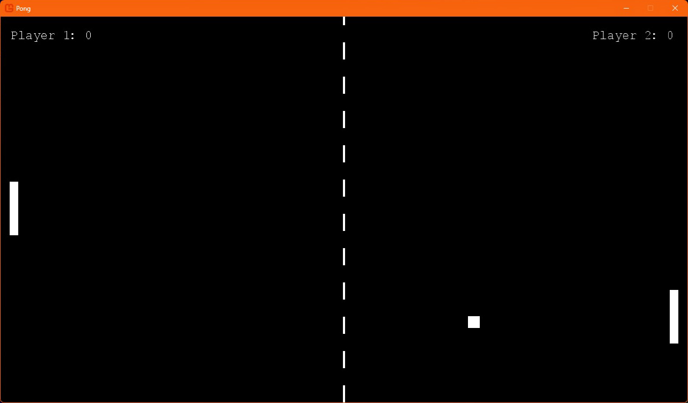

# Pong

  

## An implementation of Pong using C# and the MonoGame .NET framework  

  

The classic arcade game Pong written in C# and the MonoGame framework, which provides the game runtime.

## Compilation

Given its history and inheritance from Windows-only XNA, MonoGame is probably still easier to build on Windows than other platforms, but macOS and Linux are supported.  
You'll need the .NET SDK (minimum version .NET 8.0) to compile the source.  
Full instructions for each platform can be found on the [MonoGame website](https://docs.monogame.net/articles/getting_started/index.html).  

## Notes
The [class diagram](DIAGRAM.md) shows the relationships between the classes.  
